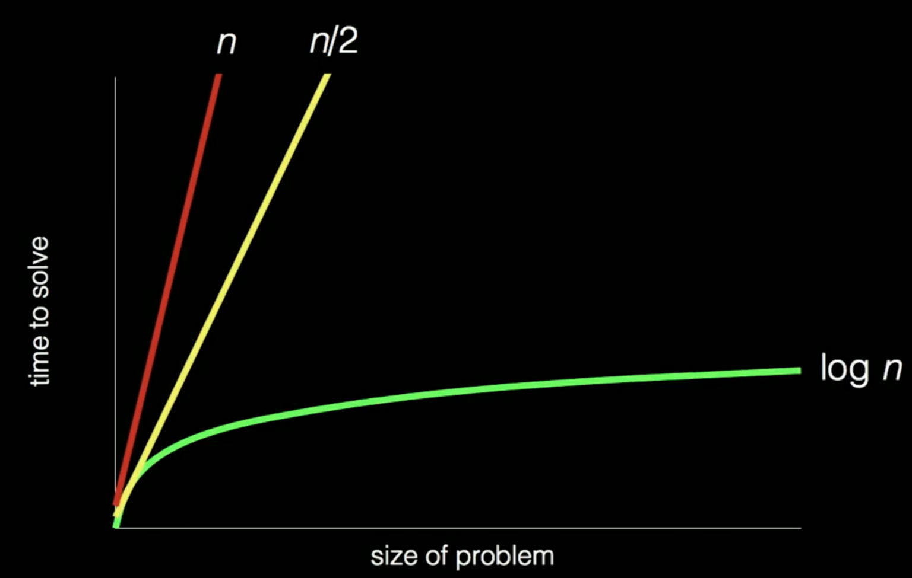

# Lecture 1

## Binary

binary vs unary notation

123 = 1 * 100 + 2 * 10 + 3 * 1

10^0 = 1

binary = powers of 2

101 = 1 * 2^2 + 0 * 2^1 + 1 * 2^0 = 5

010 = 2
011 = 3
100 = 4
111 = 7

bit = 2^0 || 2^1

Representing latin characters
**A = 65 = 01000001**

ASCII = American Standard ........

 
33 = !

UNICODE is a superset of ASCII

128514 = tears of job emoji

RGB = red green yellow

## Algorithm

step by step instructions to do something

